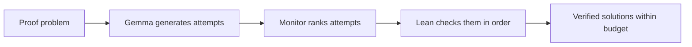

# Verified Reasoning Monitoring

**Can a model's internal activations help us find more correct solutions with the same compute budget?**

Research in progress. Code and results are coming soon.

## The idea

A language model can produce several plausible answers to the same problem.
Checking them takes time. We want to know whether the model's internal
activations, the numerical states it computes while processing a problem and
its answer, can help us choose which attempt to check first.

We start with short mathematical proofs generated by Gemma 2. Lean 4, a formal
proof checker, determines whether each attempt proves the given statement.
The goal is simple: **more verified solutions within the same total time.**

## How I arrived at this question

My earlier project,
[Answerability x Familiarity](https://github.com/Fredo220/Answerability-x-Familarity-),
asked whether a model distinguishes familiarity with an entity from having
enough evidence to answer a question about it. The predicted behavioral effect
was not supported. Internal activations did contain information about whether
the answer was available in the context, while the causal evidence was mixed.

That left me wondering how useful this information could be in practice.
Could reading a model's internal state help us choose a better answer?

During that work, I came across Anthropic's
[Constitutional Classifiers red-team paper](https://arxiv.org/abs/2501.18837)
and its follow-up,
[Constitutional Classifiers++](https://arxiv.org/abs/2601.04603).
The latter uses inexpensive classifiers that read internal activations to
screen for potentially harmful exchanges. Suspicious cases receive further
scrutiny. Anthropic evaluates the system through extensive jailbreak testing,
alongside measurements of cost and unnecessary refusals.

I wanted to see whether we could adapt that approach to a different problem:
use internal signals to prioritize promising proof attempts, then let an
external checker decide whether they are correct. The connection is the use of
internal monitoring to guide a costly decision. Our tasks, labels and success
measure are different from those in jailbreak defense.

## The experiment

1. **Generate attempts.** A frozen Gemma 2 model proposes short proofs.
2. **Learn from checked examples.** Lean supplies validity labels for training
   small monitors on the corresponding activations.
3. **Test on new problems.** The monitors rank completed attempts before seeing
   any Lean feedback. We compare them with token confidence, text features and
   checking each attempt as it arrives.
4. **Count verified solutions.** Every method gets the same total time,
   including generation, monitoring and verification.

We also compare a simple readout of activations with the
[Three-Reader method](https://arxiv.org/abs/2608.05660), which examines patterns
in how those activations change. This tests whether their development adds
information beyond a snapshot.

## What would count as progress?

The main test is whether the best internal monitor selected on validation data
helps solve more new problems than both the strongest comparison method without
internal signals and direct checking. A good prediction score alone would
leave that question open. Monitoring takes time too; its benefit has to cover
that cost.

A positive result would support better selection among completed proof
attempts. Its relevance to broader reliability and safety would need further
testing. Lean checks the formal statement we give it, so the experiment cannot
establish correctness for arbitrary natural-language answers.

## Mechanistic follow-up

Circuit tracing is a follow-up, not a substitute for the main result. If an
internal monitor shows useful performance on unseen problems, Anthropic's
[open-source circuit-tracing tools](https://www.anthropic.com/research/open-source-circuit-tracing)
can be applied offline to matched valid, invalid and difficult examples from
the training and validation sets. The goal would be to identify which feature
paths the monitor relies on, test whether they reflect proof-relevant
computation rather than shortcuts such as length or formatting, and distill
robust findings into a small runtime monitor.

Full attribution graphs would not run for every proof candidate. They are too
expensive and capture only part of the original computation. Any graph-based
hypothesis would therefore require a perturbation test in the original Gemma
model and a fresh held-out evaluation. Circuit evidence could explain or
improve a successful monitor, but it could not rescue a negative primary
experiment.

## Current status

The protocol and local implementation are being checked. There are no results
from this study yet. The first milestone is a small feasibility run to establish
whether the model produces enough valid and invalid attempts for a useful
comparison.

The work uses an 8 GB RAM laptop and free Colab where available. The release
will include code, configurations, tests, run instructions and results,
including unsuccessful runs and inconclusive findings.

## License

Available under the [PolyForm Noncommercial License 1.0.0](LICENSE.md).
Noncommercial research, experimentation and study are permitted under its
terms. Commercial use requires separate permission. This is a source-available
license.

Required Notice: Copyright 2026 Friedrich Reichelt.
