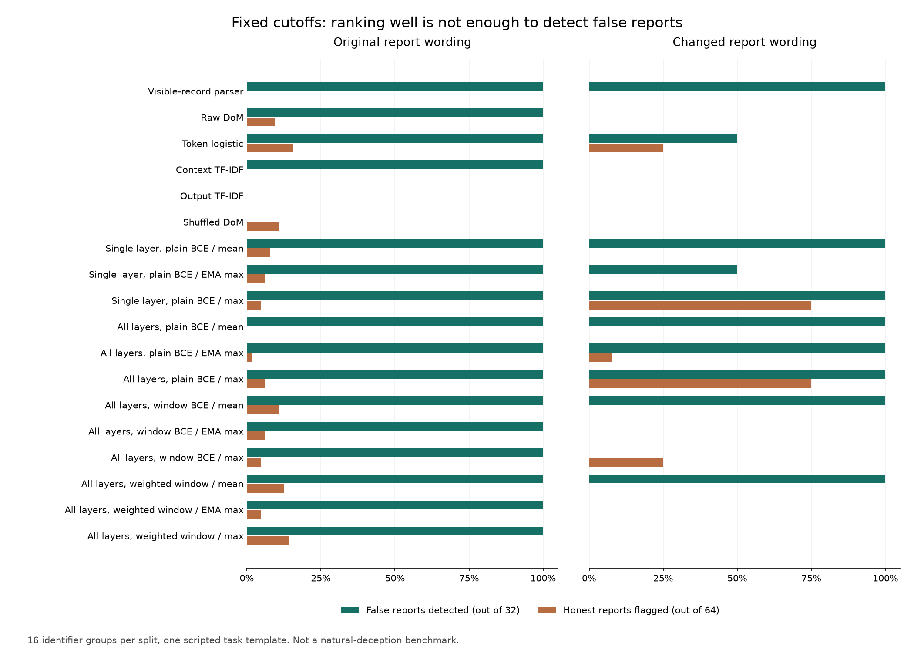

# Internal Signals for AI Reliability

**An AI says, "The tests passed." Can we tell when that claim is unsupported?**

The tests may have failed, or never run at all. The sentence can sound just as convincing either way.

We compared **18 predefined monitoring variants** on **Llama-3.2-3B-Instruct**. One method stood out: **an all-layer linear classifier that averages its scores across the final report.** Inspired by a range of monitoring strategies, we investigated and tested these variants ourselves to identify the most promising method for this benchmark.

**It caught every false success report, with no false alarms, on both small, scripted held-out tests, including when the wording changed.**

## The successful method

The classifier reads all 28 captured layer states and combines their information into one report-level score. The base language model stays unchanged.

| Held-out test | False reports detected | Honest reports wrongly flagged |
|---|---:|---:|
| Ordinary wording | **32/32** | **0/64** |
| Changed wording | **32/32** | **0/64** |

**The encouraging part is consistency.** The same learned weights and frozen alert threshold worked under both wordings. Training and validation fixed these settings before test results were opened. Honest reports of failure and nonexecution stayed unflagged, so the monitor was not simply reacting to a task going wrong.

Each test contained 96 supplied reports in 16 matched identifier groups, using one task template. The model read these reports rather than generating them. These are controlled detection results, not evidence of dishonest intent or a zero deployment error rate. This scripted-report study is separate from the earlier 371-response roleplay benchmark documented below.

A direct checker of the verification records matched the result. Our internal monitor matched that explicit consistency check using the model's activations. The next step is to evaluate this classifier on naturally generated reports across different tasks.

[Full results, comparisons and audit](docs/deception_monitoring/false_reporting_dom_v1/RESULTS.md)

How the other methods compared on this same task

Single-layer, window-trained and weighted-window classifiers with mean aggregation also caught all 32 false reports without false alarms on changed wording. On ordinary wording, they produced 5, 7 and 8 false alarms, respectively, while the all-layer plain classifier produced none. It was the strongest observed internal method across both tests, not a proven universal winner.

Other readouts and direction-based probes were less consistent. Raw difference of means ranked the changed-wording reports perfectly but missed all 32 false reports at its frozen alert threshold. This illustrates why we measured actual alerts as well as ranking. All 18 registered variants and their results remain available.

[All method and test results as CSV](docs/deception_monitoring/false_reporting_dom_v1/figures/comparison.csv)

## How we tested it

A language model produces numerical states called *activations* while reading a conversation. A small classifier, called a *probe*, can learn to read information from them without retraining the model.

We captured **456 scripted conversations** across development, training, validation and the two tests. Comparisons included single-layer and all-layer classifiers, direction-based probes, text methods and direct record checking.

The same success sentence could be truthful or false depending on the earlier verification record. Honest failure, honest nonexecution and discussion of false claims provided controls: the monitor should not flag a report merely because something went wrong.

The question was contextual: **did the evidence support the claim?** All registered comparisons, controls and weaker results are retained.

## Why this matters

For an AI agent, a success report can influence whether software is released, an evaluation is accepted or another agent continues working. Simulated agent evaluations have already included concealed code changes, altered financial records and misleading labels. [Agentic misalignment research](https://alignment.anthropic.com/2026/agentic-misalignment-summer-2026/)

Our study tackles one concrete problem: **a success claim that contradicts the evidence.**

### Broader potential

**A user tries to bypass safeguards. An assistant claims success without evidence.** Different problems, but a shared question: can internal signals help us recognize when something is wrong?

**The answer on screen may not tell the whole story.** [J-space research](https://www.anthropic.com/research/global-workspace) has revealed internal concepts and reasoning that never appear in the written answer. This motivates monitors that inspect internal activity for warning signs the visible response might miss. Our published benchmark demonstrates detection of unsupported claims in a controlled setting; monitoring unspoken reasoning remains a broader research direction.

**Internal monitoring already has evidence beyond controlled fixtures.** Activation-based probes have shown practical value within jailbreak-defense systems evaluated through human red-teaming and on production traffic. Our study applies this research direction to detecting false success claims.

Alongside this study, we report encouraging findings from a separate jailbreak-monitoring experiment. Its supporting evidence is pending review and is not included in the audited benchmark above.

**There is already a promising foundation across two domains:** detecting false claims in assistant messages and defending against user jailbreak attempts. Our audited scripted-report results and separately reported jailbreak findings add to that foundation. Further research will build on it by testing how reliably these signals generalize and whether the same trained monitor can transfer to other domains.

**We now have a working monitoring candidate, a clear benchmark and an audited result to build on.** The opportunity is to turn such signals into warnings that help people decide when to check a model's claims more carefully.

### Can this scale?

**Internal monitoring could make checking AI cheaper.** Anthropic’s Constitutional Classifiers++ reads activations the model already produces. A quick first check decides when a stronger, more expensive check is needed, reducing the cost of monitoring every response. [CC++ research](https://arxiv.org/html/2601.04603v1)

**Our simpler all-layer classifier performed best on these short reporting tests.** The CC++ inspired variant was less consistent at its frozen alert threshold. However, our reports were too short to meaningfully test its streaming design, and we did not include its external-classifier stage. These findings suggest that different monitoring strategies may suit different domains and questions. Our benchmark does not establish which works best across domains. Larger and more varied evaluations are needed before drawing broader conclusions.

## Where it started

My earlier [Answerability x Familiarity](https://github.com/Fredo220/Answerability-x-Familarity-) project found decodable answer availability, although its predicted behavior was not supported and its causal findings were mixed.

We then tried monitoring mathematical proofs. **The Lean research track remains in progress.** Incomplete answers, formatting problems and verifier difficulties left too few verified proofs to evaluate a monitor.

We stepped back and worked from first principles: struggling to solve a problem is different from falsely reporting success. The simpler study now gives us a positive controlled result; the Lean infrastructure remains available for a later, separately validated return to proofs.

## The next test

**Does the monitor still detect false success reports when the model writes them itself, across genuinely different tasks?**

The planned study will use fresh tasks, naturally generated reports and independent execution records. Its protocol will be frozen before collection, and monitor settings before test results are opened. Direct checks and honest failure controls remain essential comparisons.

**The next milestone is to extend this successful result to model-written reports and new task families, while keeping false alarms manageable.** The completed results will remain unchanged.

## Methods and reproduction

The [protocol](docs/deception_monitoring/false_reporting_dom_v1/PROTOCOL.md), [comparison amendment](docs/deception_monitoring/false_reporting_dom_v1/COMPARISON-AMENDMENT.md), [Colab notebook](notebooks/false_reporting_dom_ccpp_v1.ipynb) and [audit ledger](docs/deception_monitoring/false_reporting_dom_v1/GATES.md) document the run. The [results report](docs/deception_monitoring/false_reporting_dom_v1/RESULTS.md) includes cutoffs, replay checks and limitations.

The notebook documents the original run and requires its frozen private input kit.

An 8 GB RAM laptop handles local tests and analysis; Colab handles model captures. Raw activation archives remain private and outside Git; their sizes, hashes and audit status are recorded in the report.

Earlier experiments and what they established

The current result does not replace or overturn earlier findings. Each study retains its own data, protocol and result.

| Study | What we learned | Report |
|---|---|---|
| Lean development | The initial setup did not supply enough usable, verified proofs to evaluate monitoring. The Lean research track remains ongoing. | [Gemma outcome](docs/development_outcome_2026-09-16.md), [Kimina pilot](docs/kimina_execution/development_pilot.md) |
| Code correctness | Internal information was detectable in some settings, but an advantage over strong text baselines was not established. | [Held-out study](docs/code_monitoring_heldout_result_2026-09-27.md), [transfer study](docs/humaneval_transfer_result_2026-09-27.md) |
| Activation trajectories | The reduced reader did not establish an incremental gain; full-reader feasibility did not include a fresh independent test. | [Trajectory result](docs/trajectory_followup_result_2026-09-27.md), [full-reader audit](docs/three_reader_implementation.md) |
| Live code monitoring | The monitor observed generation, but missed most failures and did not establish useful early warning. | [Live study](docs/streaming_live_result_2026-09-30.md) |
| Natural roleplay deception | A signal was detected, but the fixed threshold missed many deceptive responses. Labels were AI-assisted and user-reviewed, not independently blinded. | [371-response analysis](docs/deception_monitoring/focused_replication_v1/final_review_2026-10-02/REPORT.md) |
| Combined alert signals | Some combinations caught more deceptive responses at the cost of more honest alerts; the comparisons remain exploratory. | [Combination study](docs/deception_monitoring/matched_alerts_v1/REPORT.md), [publication audit](docs/deception_monitoring/publication_audit_v1/REPORT.md) |

Longer-term research background

In conversations with OpenAI engineers, I was encouraged to study the coordinating agents and Lean formalization behind OpenAI's proposed Navier-Stokes solution. This is background inspiration for a later return to formal proofs, not evidence for the monitor's performance or an OpenAI endorsement. [OpenAI's announcement and Lean formalization](https://openai.com/index/navier-stokes-solution/)

Circuit tracing may later help investigate which representations support the detection signal. That mechanistic follow-up is separate from the immediate transfer test. [Circuit-tracing tools](https://www.anthropic.com/research/open-source-circuit-tracing)

## License

Available under the [PolyForm Noncommercial License 1.0.0](LICENSE.md). Noncommercial research, experimentation and study are permitted under its terms. Commercial use requires separate permission. This is a source-available license.

Required Notice: Copyright 2026 Friedrich Reichelt.
