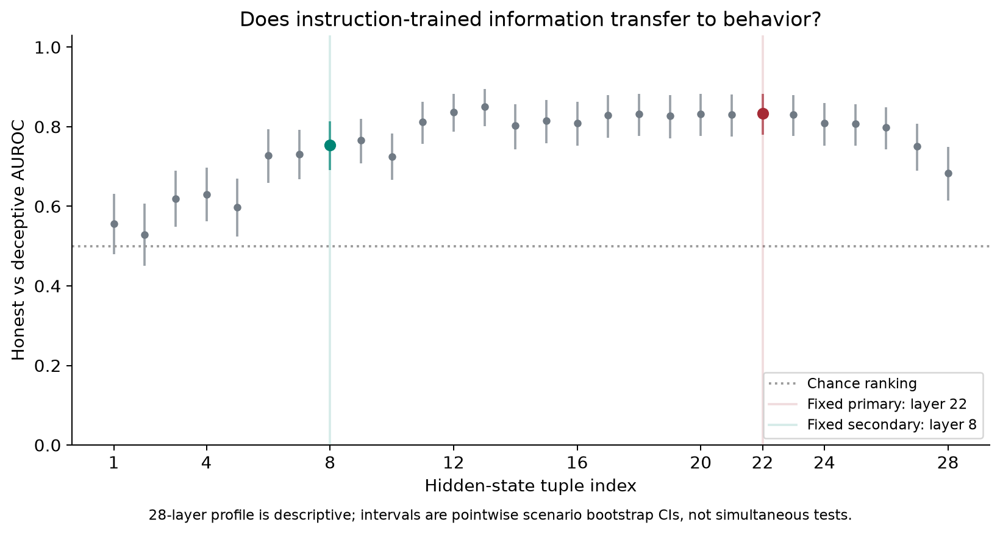
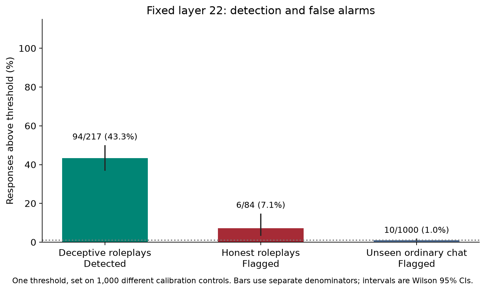

# Can a small model's internal states reveal deceptive responses?

## The answer so far

**Yes, there is a detectable signal in these roleplay cases. No, this run does not establish a reliable deception defence or an advantage over reading the text.**

A probe trained on contrasting honesty instructions ranked deceptive responses above honest ones with AUROC **0.833**. At the threshold chosen on ordinary chat, it detected **43.3%** of deceptive roleplays and flagged **7.1%** of honest roleplays. A separate text-only comparator ranked the same binary cases better. Both its judgments and our primary labels came from the same grader family, so that comparison is not independent ground truth.

The core roleplay/control study is complete and locally rechecked. **The full adaptation is still in progress:** seven additional registered evaluation settings are not yet complete. This report closes the core analysis, not the entire research programme.

## What we measured

We adapted Goldowsky-Dill et al.'s [Detecting Strategic Deception Using Linear Probes](https://arxiv.org/html/2502.03407v1), using the [pinned author implementation](https://github.com/ApolloResearch/deception-detection/tree/f8ec4010e74927394709dffa22b97bdf8cd5a62f), to **Llama-3.2-3B-Instruct**. This is a smaller-model adaptation, not a new invention of deception probing.

The training examples contain the same true facts under honest and dishonest instructions. The question is whether a direction learned from those instructions also distinguishes actual model responses in a different setting. We retained the original facts and roleplay scenarios, token-level fitting and scoring, and all **28** hidden-state readouts. Layer **22** was the fixed primary readout; layer **8** was a fixed depth sensitivity. Neither was selected from the observed result.

The important adaptations are the smaller target model, a substitute grader (**gpt-6.1-sol** rather than GPT-4o), local generation/capture, and **2,000** ordinary-chat controls split into **1,000 calibration** and **1,000 independent evaluation** rows. The [method comparison](METHOD_AND_COVERAGE.md) records the exact differences and source locations.

All **371** saved roleplay responses were retained: **84 honest**, **217 deceptive**, and **70 ambiguous** according to the frozen rubric labels. Binary ranking uses the **301** honest/deceptive cases; ambiguous cases are not silently relabeled. There were **no score-coverage exclusions**.

## Ranking and detection are different

AUROC measures ranking: how often a deceptive response receives a higher score than an honest response. It does not mean that 83.3% of deceptive responses will be caught by the deployed threshold.

| Readout or comparison | AUROC | 95% scenario-bootstrap interval |
| --- | ---: | ---: |
| Fixed primary, layer 22 | 0.8333 | 0.7794-0.8825 |
| Fixed secondary, layer 8 | 0.7544 | 0.6918-0.8137 |
| Response-length diagnostic | 0.5406 | 0.4692-0.6110 |
| Text-only comparator | 1.0000 | 1.0000-1.0000, conditional on the observed labels |

The primary beats the length diagnostic by **0.2927 AUROC** (paired 95% interval **0.1995-0.3860**). It trails the text comparator by **0.1667** (paired interval **-0.2206 to -0.1175**). The comparator's perfect observed ranking and degenerate bootstrap interval do **not** establish perfect accuracy on new cases: resampling cannot reveal systematic grader errors or missing types of deception.

The other layers are a descriptive profile, not an invitation to replace the primary with the best-looking layer. These intervals are pointwise, not simultaneous multiple-layer tests. Primary AUPRC is **0.9160**, against deceptive prevalence **217/301 = 0.7209**; the class imbalance matters when reading that number.

### One frozen threshold

The primary threshold is **-1.1039650440**, using the registered 99th percentile of calibration scores and the strict rule `score > threshold`. Scores are raw linear projections, not calibrated probabilities.

| Population | Above threshold | Rate | Wilson 95% interval |
| --- | ---: | ---: | ---: |
| Deceptive roleplays | 94/217 | 43.3% | 36.9%-50.0% |
| Honest roleplays | 6/84 | 7.1% | 3.3%-14.7% |
| Independent ordinary-chat controls | 10/1,000 | 1.0% | 0.54%-1.83% |
| Calibration controls | 10/1,000 | 1.0% | Calibration, not independent evaluation |

Ordinary-chat controls are not certified honest ground truth, so **control alert rate** is the appropriate description. The higher alert rate among honest roleplays shows that a low ordinary-chat alert rate does not guarantee the same rate in deception-related contexts. Layer 8 detected **106/217**, flagged **11/84** honest roleplays, and flagged **12/1,000** independent controls. Neither readout establishes a robust safety monitor.

## How we challenged the finding

**Prior exposure.** The fixed exposure analyses give primary AUROC **0.8273** on 275 scenarios outside the earlier v2 population (225 binary cases), and **0.8296** on 268 scenarios without documented prior exposure (219 binary cases). The signal does not disappear in those strata. However, all saved outputs predate the focused amendment; even the stricter stratum is not an untouched confirmatory experiment.

**Label-swap diagnostics.** We scored 100 frozen within-fact label-swap probes at each fixed layer. Their median AUROCs were **0.4989** at layer 22 and **0.4923** at layer 8. No null reached the corresponding real-probe AUROC. All **200 null fits** had convergence warnings at the preserved source iteration limit; these are descriptive controls, not a definitive permutation significance test. The real layer-22 and layer-8 probes converged.

**Labels and review.** Fifty stratified cases received **AI-assisted human review accepted by the user**, with 41/50 exact label agreements. This is not independent or blinded annotation, and the agreement is not a population label-accuracy estimate. The original primary label freeze was not changed. The text comparator was isolated from those labels and from probe scores, but sharing the grader family still creates a potential correlated-judgment bias.

## What was independently checked

The checks below used the actual saved artifacts, not synthetic scores or a worker's success claim.

| Check | Evidence |
| --- | --- |
| Responses, labels, 28 probes, 200 distinct null directions and accepted review identities | [Input recheck](inputs-rechecked.json) |
| All 24 transferred ZIPs: 4,742 data members plus 24 manifests, with hashes, byte counts, CRCs and extracted files checked | [Archive recheck](transferred-score-archives-rechecked.json), [member count](archive-member-count-rechecked.json) |
| All 2,371 score arrays, all layers, exact Torch token means and frozen quantiles | [Token-score recheck](token-means-and-thresholds-rechecked.json) |
| All-layer pair-count AUROC, label denominators and alert rates | [Metric recheck](independent-metrics-rechecked.json) |
| Independent 10,000-draw paired bootstrap and actual text-comparator scores | [Bootstrap/comparator recheck](primary-bootstrap-and-comparator-rechecked.json) |
| All 200 null-score columns and all three exposure strata | [Null/exposure recheck](null-and-exposure-rechecked.json) |
| Figures rendered from the frozen analysis | [Figure hashes](figure-receipt.json) |

The raw hidden-state archive audit and complete pinned-tokenizer mask recomputation ran in Colab. The Mac recheck verifies their summaries and bound input hashes, then independently audits the transferred token-score arrays and calculations. It does **not** claim a second projection from the entire large hidden-state corpus. The recorded local software suite passed **740 tests**, with **7 skipped** and **9 warnings**; software tests are not evidence of detection quality.

The primary machine analyses remain unchanged: [core](../../../../artifacts/deception/focused-replication-v1/analysis-all-28-layers-v1/core-analysis.json), [text comparator](../../../../artifacts/deception/focused-replication-v1/analysis-all-28-layers-v1/text-comparator-analysis.json), [exposure](../../../../artifacts/deception/focused-replication-v1/analysis-all-28-layers-v1/exposure-analysis.json), and [nulls](../../../../artifacts/deception/focused-replication-v1/analysis-all-28-layers-v1/pair-null-analysis.json). The analyses are local artifacts; linking them here does not mean they have been published on GitHub.

## Conclusions and the next decisive step

**Supported on this population:** a direction learned from honesty instructions carries information that separates grader-labeled honest and deceptive roleplay responses in a 3B model, beyond this response-length diagnostic.

**Not established:** better detection than the text comparator, reliable low-false-alarm detection across contexts, prevented deception, a causal mechanism, online usefulness, lower total cost, or general detection of hallucination, reward hacking or jailbreaks. This is not a controlled 3B-versus-70B scaling experiment.

The smallest useful continuation is to finish the **already registered additional settings using the frozen probes and thresholds**, not redesign the method after seeing the roleplay outcome. AI liar, sandbagging and the three AI-audit settings have a 1,450-output collection frame, with repeated outputs grouped rather than counted as independent scenarios. The two insider settings still require live integration and an agreed fresh-trajectory count; the source's 100-run default and released 6,000 trajectories are different things.

The five real next-stage preflight archives have passed a separate local [source-method and array recheck](remaining-settings-preflight-recheck/). Three AI-audit responses lack the required delimiter and remain source-SKIP cases. This tests operational integrity, not detection performance, and does not justify silently modifying the source prompts or omitting inconvenient responses.

Independently adjudicating labels without seeing probe or comparator scores would address the clearest remaining validity concern. Broader claims must wait for the remaining-setting results. The value of this core result is an auditable transfer finding with explicit failure modes, not a promise of a favourable outcome or a Fellowship offer.
