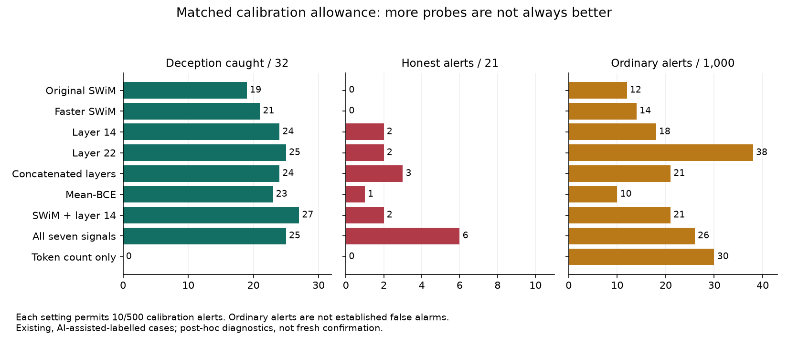

# Deception-monitoring score release

Can combining internal monitoring signals catch more deceptive responses? On a small, already-inspected roleplay sample, some combinations do. More signals do not always help.

This package reproduces the **exploratory matched-alert diagnostic**, not a new independent test or the full 371-response analysis. Its evaluation has **32 deceptive, 21 honest and 22 ambiguous responses** from Llama-3.2-3B-Instruct. Ratings were AI-assisted and accepted by the researcher; they are not independent blinded annotations.

## Read the result

At a 2% calibration alert allowance, SWiM plus layer 14 caught **27/32** deceptive responses and flagged **2/21** honest responses. Layer 22 alone caught **25/32**, also with **2/21** honest alerts. A more aggressive combination of the trained 8/14/22 concatenation head and the all-layer mean-BCE head caught **31/32**, with **6/21** honest alerts at a 10% allowance.

These configurations were identified after examining evaluation results. They are candidates for fresh validation, not confirmed best detectors. Alerts are suitable hypotheses for review, not accusations of intent.

Ordinary evaluation responses are **not independently labelled honest**. Their alert counts are not a measured honest false-positive rate. The allowance is measured on 500 cutoff-calibration responses, not a guarantee for another population.

**Layer 8 + 22 without 14 was tested as score fusion**, not as a new two-layer concatenation probe. At 2%, that fusion caught 19/32 deceptive responses and flagged 7/21 honest responses, worse than layer 22 alone here. The trained concatenation probe uses layers 8, 14 and 22.

## Reproduce without a GPU

1. Extract the ZIP into its own folder.
2. Run `python3 reproduce.py` there using Python 3.12 or newer.
3. Expect `DECEPTION_RELEASE_REPRODUCED 514`.

No dependency installation, model weights, private files or API tokens are needed. The runner independently recalculates calibration normalization, strict cutoffs, case-level detections, all 514 alert-count settings, seven single-head AUROCs and the length-only control. It verifies member hashes before calculating. Bootstrap intervals and permutation controls are retained in `results.json` but are **not recomputed by this compact runner**.

`scores.csv` contains only derived scores, token counts, study IDs and accepted evaluation labels. Calibration-fit and calibration-cutoff sets contain 500 responses each; ordinary evaluation contains 1,000. No raw prompts, responses, activations, reviewer identities or credentials are included.

## What remains unresolved

The saved-score checks cover all 2,075 score pairs, but the full **raw activation-to-score audit has not passed**. The original audit failed its numerical comparison; its exact failing record and cause remain unresolved. This package verifies calculations conditional on saved scores, not the original activation pipeline.

The 21 honest evaluation responses are too few to establish a low deployment false-alarm rate. Scenario-family transfer, independent label quality, model comprehension, prevention and performance under adversarial adaptation have not been established. A new performance test must freeze one rule before unused scenarios and independent score-blind ratings are opened.

## Methods and attribution

The roleplay study adapts [Detecting Strategic Deception Using Linear Probes](https://arxiv.org/abs/2502.03407v1), using a smaller model and different grading. The all-layer probe experiment is inspired by [Constitutional Classifiers++](https://arxiv.org/abs/2601.04603v1); it is not a replication of Anthropic's deployed classifier cascade. Neither source establishes our small-model result in advance.

The original frozen method/input hashes and normalization parameters are retained in `results.json`. `release-manifest.json` binds every packaged file. The preserved training/inference environment is documented in the repository's frozen design; this lightweight score release does not retrain it.

Original project code and derived results use the existing [PolyForm Noncommercial 1.0.0 license](../../../LICENSE.md). Third-party material is not relicensed. Copied upstream datasets/code and raw captures are intentionally omitted because their redistribution permission has not been established. Publishing this score package does not resolve access to those materials.
