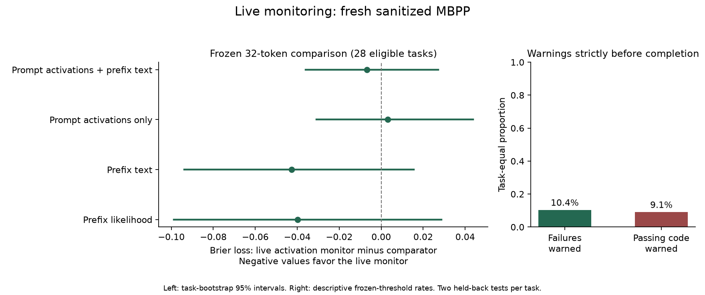

# Can we monitor code failures while the model is still generating?

**Completed fresh-task study, 30 September 2026. The primary result is inconclusive.**

We ran the frozen monitor during actual generation, without changing the
model's tokens. We then checked every attempt independently. The monitor can
produce causal, prefix-only risk scores, but this small study did not establish
that watching generation adds reliable predictive value beyond the controls.
Some failures were warned about early; most were missed.



## What we actually tested

The frozen Qwen2.5-Coder-1.5B-Instruct model generated four natural attempts for
each of 42 unused sanitized MBPP tasks: **168 attempts, all ending at EOS**.
The logged 4096-token technical guard was not reached. No attempt was repaired,
resampled or removed after its test outcome was seen.

The prompt supplied the problem and the first public example assertion. Only
the next two original assertions supplied the private label. Passing them means
**passing these two tests**, not proving the program correct for every input and
not passing the augmented MBPP+ suite.

All 168 saved receipts and predictions passed the local provenance audit before
the first candidate outcome was opened. We executed 155 extracted programs in
isolated Docker and classified 13 extraction failures before execution:

| Outcome | Attempts |
|---|---:|
| Passed both held-back tests | 58 |
| Failed at least one held-back test | 97 |
| Could not extract code under the frozen policy | 13 |
| Syntax, timeout or infrastructure error | 0 |

Extraction failures remain in the operational denominator. They are not silently
treated as functional test failures. The primary pass/test-fail analysis has 155
potentially eligible attempts, fewer when a required prefix has not been reached.

## The monitor and its controls

The pre-generation probe forecasts failure risk from the final prompt state.
The live probe adds smoothed observations from all 28 layers as tokens arrive.
Its forecast sees only the prompt and the tokens already generated. It cannot
see the remaining output, reference code, private tests or verifier results.

The weights were fitted previously on opened training data. Neither weights nor
thresholds were fitted on these fresh tasks. We compared:

- **Prompt + live activations:** the primary monitor.
- **Prompt activations only:** the pre-generation forecast.
- **Prompt activations + prefix text:** the forecast plus ordinary text features.
- **Prefix text:** no hidden-state inputs.
- **Prefix likelihood:** token probabilities, with no hidden-state inputs.

The first two comparators above already use internal prompt information. Calling
all controls "non-internal" would be wrong. Full Three-Reader, steering and
generation-time routing were not part of this study.

## Primary result: no established incremental advantage

At the frozen 32-token checkpoint, only **76 functional attempts from 28 tasks**
were eligible: 25 passes and 51 failures. Of these, 72 were still generating and
four were at their last content token. Shorter attempts are retained in the full
inventory but cannot supply a 32-token prediction.

The primary measure was Brier loss, which penalizes inaccurate probability
forecasts. Each task received equal weight. The table shows the live monitor's
loss minus each comparator's loss; negative values favor the live monitor.
Intervals use 10,000 paired task-bootstrap draws with the frozen seed 33.

| Comparator | Difference | 95% interval |
|---|---:|---:|
| Prompt activations + prefix text | -0.0067 | [-0.0359, +0.0271] |
| Prompt activations only | +0.0032 | [-0.0308, +0.0438] |
| Prefix text | -0.0427 | [-0.0938, +0.0156] |
| Prefix likelihood | -0.0399 | [-0.0989, +0.0288] |

Support required a negative upper interval bound against **all four** controls.
Every interval crosses zero, so the frozen evaluator returned `inconclusive`,
not confirmation and not proof that no useful internal signal exists.

The live monitor's pooled AUROC was **0.711**, versus **0.677** for the prompt
forecast and **0.667** for prefix likelihood. These are descriptive candidate-level
rankings, not independently replicated effect sizes. In particular, pooled
ranking can reflect differences in task difficulty rather than distinguish two
attempts at the same task.

That distinction matters here: 12 tasks naturally had both passing and failing
attempts, but only seven had both outcomes at 32 tokens. On those seven tasks,
the live monitor's within-task rank was **0.333**, compared with **0.560** for
prefix likelihood. This small descriptive comparison does not support better
selection of solutions to the same problem.

## Advance warnings: real, but low coverage

Alerts were evaluated at 16, 32, 64 and 128 observed tokens. Although the hook
updates each token, this report does not evaluate a continuous every-token alert
policy. Thresholds were fixed using 40 previously opened training-calibration
tasks, with the same conservative numerical margin for all methods.

The live monitor warned strictly before completion for **11 of 97 functional
failures**. These warnings had a median of **68 content tokens remaining**.
It also warned on **two of 58 passing attempts**. No functional failure was
caught only at a terminal, zero-lead checkpoint.

The pooled detection rate was 11.3% and pooled false-alarm rate 3.4%. With equal
task weighting, the rates were **10.4% detection** and **9.1% false alarms**:
failures occurred across 32 tasks and passes across 22. The weighting difference
is material and must not be hidden by reporting only the smaller false-alarm
number. Most functional failures were missed. Four additional alerts concerned
extraction failures, not functional test failures.

Prefix text and likelihood each warned on ten functional failures and two
passes. These descriptive counts do not establish a reliable advantage for
the eleven failures caught by the activation monitor. The calibration procedure
does not guarantee a fixed false-alarm rate on new tasks.

## Coverage at every registered checkpoint

| Observed tokens | Functional attempts | Eligible tasks | Live pooled AUROC |
|---|---:|---:|---:|
| 16 | 154 | 42 | 0.649 |
| 32, primary | 76 | 28 | 0.711 |
| 64 | 40 | 18 | 0.753 |
| 128 | 15 | 10 | 0.750 |

These rows contain different populations. Rising AUROC across rows cannot be
read as evidence that the monitor improves over time on the same attempts.
Checkpoints were not selected after seeing these values.

## Execution and repairs

The real free-T4 smoke compared observed and unobserved generation with identical
seeds on two opened development prompts. Complete generated token sequences were
identical. Cached-prefix scores matched causal replay at 16/32/64/128 tokens,
with a maximum probability difference of 0.0000353, below the frozen 0.005 tolerance.
That validates this numerical path, not universal monitor accuracy or precise
overhead. Live activation and prompt-prior scores were captured in the actual
generation loop. Text and likelihood comparator scores were calculated afterward
from strictly prefix-only inputs; their prediction quality, not live latency,
was evaluated.

The first proposed HumanEval reserve was rejected **before generation** because
the receipt inventory showed its outcomes had already been opened. The 42 MBPP
tasks are unused by task ID and normalized prompt in the recorded allocations.
This does not exclude semantic variants or model-pretraining contamination.

Known-reference verification caught a plumbing issue before candidate labels
were opened: one source task contained more than three assertions. The worker
was uniformly corrected to use exactly `test_list[1:3]`, as registered, rather
than reject extra source assertions. All 42 reference implementations then
passed. Correct, incorrect, syntax-invalid and nonterminating controls were also
checked in Docker. The original worker and a hash-bound repair amendment remain
available; no generated candidate or scientific endpoint changed.

The inherited Docker boundary uses the pinned image, no network, a non-root
user, read-only mounts, dropped capabilities and resource limits. Candidate code
was never executed in the Mac interpreter or the credential-bearing Colab
process. This is not a new adversarial-security certification: candidate code and
assertions share a Python interpreter inside the container, and the two-test
label has limited coverage.

Generation, including live observation and event writing, took **509.08 seconds**;
additional saved activation capture took **18.34 seconds**. Model loading,
training/control recovery, Docker verification and artifact transfer are not
included in these totals. Drive synchronization was slow; the completed archive
was retrieved privately and verified locally without repeating generation.
No compute-saving claim is made.

One resume limitation remains for future runs: interruption after a staged
candidate is written but before its prediction file is published can leave a
stage that the current collector does not recover without regeneration. This
run had no interrupted candidate and all 168 publications are complete. That
window should be repaired and fault-tested before another collection; this
report does not certify every possible crash/recovery path.

## Evidence and reproduction

The official source is Google Research's
[sanitized MBPP](https://github.com/google-research/google-research/blob/d36068b845da4c2b24927fee2cea1e6ef98dadda/mbpp/sanitized-mbpp.json).
Model and tokenizer revision: `2e1fd397ee46e1388853d2af2c993145b0f1098a`.
The Colab environment was Python 3.13.15, PyTorch 2.11.0+cu128 and Transformers
5.16.1 with FP16 on a Tesla T4. Local tests and analysis used Python 3.12.

Local artifacts are under `data/code_monitoring/streaming-live-v1/`:

- `fresh/`: hash-bound population, public prompts, analysis freeze and verifier amendment.
- `fresh-results.zip`: the original downloaded archive, 40,274,030 bytes.
- `fresh-results/receipts/`: all 168 raw candidates and live predictions.
- `fresh-results/verdicts/`: all 168 independently obtained verdict records.
- `fresh-results/outcome-opening-preflight.json`: complete pre-outcome inventory.
- `fresh-results/joined.json` and `report.json`: supplied predictions, outcomes and hash-bound analysis.
- `reference-audit-fixed/` and `smoke-results/`: the real controls and numerical checks.

Archive SHA-256:
`83a01e8d8004615d0e1c9cf3b6dcf8c9cea5405c6c842e030e0c3ba82a643ad8`.
Report record SHA-256:
`6cc03bac1a9efebf7c5c97c95282904d52127a9b60b14173c6112e0264a8dfec`.
The report includes hashes of its analysis freeze, generation marker, opening
preflight, amendment and joined records.

With the local artifact directory and pinned Docker verifier available:

```bash
.venv/bin/python -m vrm.streaming_publish \
  --figure docs/figures/streaming_live_2026-09-30.png
```

This revalidates saved receipts/verdicts and reproduces the frozen analysis. It
does not regenerate samples or choose new thresholds. No commit or public upload
was made during this execution.

## What this means, and the smallest next study

**Established:** the pipeline can observe this model during generation without
changing its sampled tokens, preserve causal prefix scores, and test them on
previously unused tasks. Some failure-related ranking is visible descriptively.

**Not established:** reliable incremental live prediction, effective early
warning, better within-task selection, causal reasoning mechanisms, safer or
more correct generation, or compute savings. This is not a test of full
Three-Reader or a replication of Anthropic's safety-classifier results.

The next useful question is whether live observations reveal anything beyond
the difficulty forecast already available from the prompt. A separate study
could learn that incremental signal on development data and register earlier
checkpoints, since many short programs finish before 32 tokens. It would need
new held-out tasks and stronger private tests. These 42 tasks are now opened
data; changing thresholds or the checkpoint here cannot confirm the original
claim. No extra study was started to rescue this result.

See the separate [methodology follow-up](streaming_monitor_methodology_followup_2026-09-30.md)
for ideas from reward-hacking and strategic-deception monitoring papers. Those
recommendations do not change the completed evaluation.
