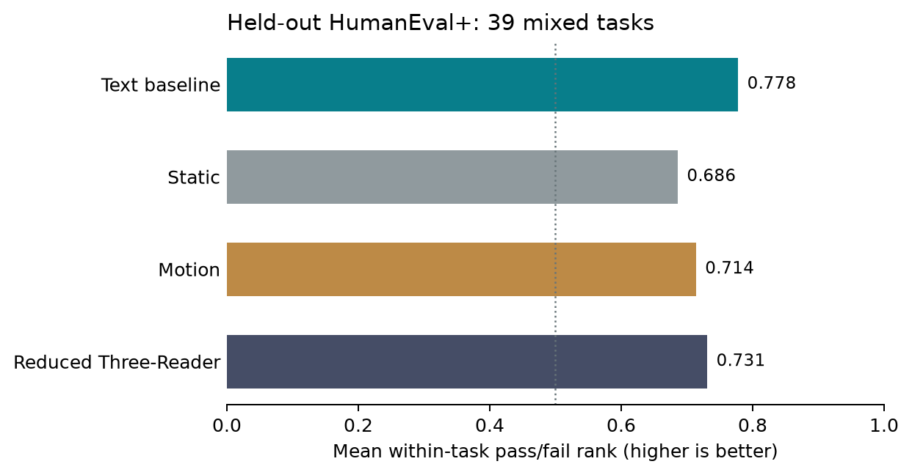

# Full-trajectory code-monitoring follow-up: completed

**Result: the internal reader did not beat the text baseline.** This is an
adaptive follow-up to the already opened MBPP+ and HumanEval+ studies, not an
independent replication of them. The [protocol](trajectory_followup_protocol_2026-09-27.md)
was frozen before generating the 76 reserve tasks; a
[resource amendment](trajectory_followup_resource_amendment_2026-09-27.md)
was recorded before their labels were opened. All target predictions were
sealed before the pinned EvalPlus verifier opened the reserve labels.

## What ran

- A frozen Qwen2.5-Coder-1.5B-Instruct generated four natural, unmodified
  Python candidates per reserve task: **76 tasks and 304 candidates**. All
  304 generation receipts, full token-by-layer activation traces, predictions
  and verifier verdicts were saved. No candidate or task was replaced.
- All 28 post-block residual states were recorded for every non-EOS answer
  token. The Motion reader pooled these recorded tokens into eight windows to
  fit local compute. The Region and Direction readers used their registered
  final-token windows. This is a **reduced Three-Reader adaptation**, not an
  exact implementation of the paper.
- The monitors trained on 144 opened MBPP+ tasks and 56 opened HumanEval+
  tasks. Only 80 training tasks had both passing and failing candidates and
  contributed a pairwise training term. Model and baseline selection used 24
  different opened HumanEval+ validation tasks, nine of them mixed. The
  76 reserve tasks supplied no training or tuning labels.
- The validation-selected non-internal comparator was the text/syntax/
  likelihood baseline (`text`). Text and mean token log-likelihood tied at
  0.889 validation within-task rank; the registered log-loss tie-break chose
  text (0.481 versus 0.636). The three neural seeds for each reader were
  averaged, not selected on reserve outcomes.
- EvalPlus base **and** plus tests provided an operational pass label. Passing
  tests is not a proof of general program correctness. The verifier ran in
  the pinned networkless Docker environment.

## Frozen result

Thirty-nine reserve tasks had at least one passing and one failing candidate.
On those tasks, a rank of 1 means every passing candidate was scored above
every failing candidate; 0.5 is chance ordering. Tasks, not candidate pairs,
are the independent units.

| Candidate selector | Mean within-task pass/fail rank |
| --- | ---: |
| Text/syntax/likelihood baseline | **0.778** |
| Static all-layer final-token probe | 0.686 |
| Motion-only reader | 0.714 |
| Reduced Three-Reader | 0.731 |

The registered Three-Reader-minus-text difference is **-0.047**, with a
10,000-draw paired task-bootstrap 95% interval of **[-0.205, +0.107]**.
The minimum of 12 mixed tasks was met; all 304 candidates received a usable
verdict and there were no infrastructure exclusions. The registered status is
therefore **`not_supported_on_reserve`**, not `not_evaluable`. The interval
does not establish that internal signals can never help; it does not support
an advantage for this reader here.

The secondary component differences were also uncertain: Three-Reader minus
Motion was +0.017 (95% interval [-0.049, +0.092]); Motion minus Static was
+0.028 ([-0.096, +0.152]). The all-task AUROC was 0.816 for text and 0.608
for Three-Reader. None of these descriptive comparisons rescues the primary
result.

Across all candidates, 148 passed, 103 failed functional tests, 44 failed
the registered extraction rule, four failed syntax and five timed out. All
304 generations ended at EOS rather than the 4096-token operational guard.
For offline one-check replay on the same candidate pool, text found a passing
candidate on 47/76 tasks, Three-Reader on 43/76, and original generation
order on 35/76; the oracle ceiling was 56/76. At two checks the corresponding
numbers were 52, 50 and 46. This is **not** a prospective equal-cost or live
cascade result. Reader probabilities were not independently calibrated, so
their Brier scores and frozen-threshold error rates are descriptive only.

Measured reserve-stage sums were 1,429 seconds of generation, about 232
seconds for full-trace replay including the separate one-candidate smoke,
415 seconds for all target monitor predictions and
684 seconds of verification. These omit opened-data trace capture, training,
model/container startup and some I/O. They cannot establish compute savings.

## Why this differs from stronger published results

This study deliberately uses a different, less curated setting than the
[Three-Reader paper](https://arxiv.org/html/2608.05660v1): its selection
items contain one correct candidate, whereas our four natural generations
can all pass or all fail. The paper's reported improvements cannot be read
as expected gains on this coding population. Our eight-window Motion pooling
may also discard brief local error signals. The small training set and nine
mixed validation tasks leave considerable uncertainty about reader fitting.
The strong text comparator can exploit obvious code-quality clues, including
extraction and syntax status.

Two **post-opening diagnostics**, not registered evidence of a new effect,
help locate the failure. Restricting to candidates that reached functional
tests left 30 mixed tasks: text ranked 0.658 and Three-Reader 0.547, so the
gap did not disappear when obvious format failures were removed. On the 96
opened validation candidates, the Region codebook used only two of 128 codes
for each of two seeds; one code received 87/96 assignments in both. This
suggests weak Region utilization, but does not prove it caused the target
result. No post-hoc retraining or target resampling was performed.

The [pre-generation probe study](https://arxiv.org/html/2602.09924v4)
predicts task-level policy success *before* a candidate exists. A score that
is constant across one task's four candidates cannot by itself improve their
within-task ranking. [Constitutional Classifiers++](https://arxiv.org/html/2601.04603v1)
uses token-level internal probes and a production safety-classifier cascade
with a different model, labels and error tolerance. This follow-up did not
test a pre-generation route, a live cascade, safety monitoring or causal
intervention. Its negative result does not contradict those papers.

## Evidence and next test

The compact [audit bundle](../protocol/evidence/trajectory-followup-v1/README.md)
contains the frozen manifest, per-candidate prediction seal and verdicts,
model-selection record and machine result. The full source receipts, model
weights and approximately 8 GB of traces remain in the local ignored
`data/code_monitoring/trajectory-followup-v1/` directory; the compact bundle
alone cannot reproduce model inference. The prediction seal SHA-256 is
`3bc4d9fdbb56c54631bf2516bf70ed980d4865aedc525060a85c03665aa2cb4a`.
An independent arithmetic check of the 304 sealed scores and verdicts
recovered 39 mixed tasks, text 0.778, Three-Reader 0.731 and the same -0.047
delta.

A future test would need *new* held-out tasks, not a rerun of these opened
reserve labels. The most useful changes to evaluate before another protected
run are more mixed training tasks, a paper-faithful token-level Motion arm or
an explicit pooling ablation, and a measured codebook-utilization gate. Only
after a reader adds value over the strong text baseline should a separate
study test a calibrated pre-generation/post-generation cascade, false alarms
and full inference costs. These are proposed experiments, not demonstrated
benefits of the current project.
